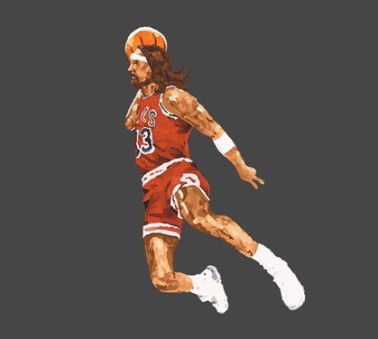

## Legs United

Scott Clark | Jamie Roberts | Maciej Kaszynski | Kristoff Liu | Oliver Xie | Tammy Yeung

### Documentation

- [Requirements](https://docs.google.com/document/d/13156ywn519An_QWeEImV5j5__AVFFo-zgKqG7HZolH8/edit?usp=sharing)
- [Architecture](https://docs.google.com/document/d/1yYBxvUv1Po4BfTDwSSL2ZOpdtSBmocLk-oVDcni-WdM/edit?usp=sharing)
- [Method Selection and Planning](https://docs.google.com/document/d/1EZsbZt13EBUWk81VG4KXxBATnYtuh7aFyn5ZFLzkh0I/edit?usp=sharing)
- [Risk Assessment and Mitigation](https://docs.google.com/document/d/1DWiCJq6-TyGzkb-Gl2I1ORbHMRxZHRy_fQkjSXIVQHU/edit?usp=sharing)
- [Implementation](https://docs.google.com/document/d/1tIjko_7QxPLY9K7xWDwy3DejCkkLC1H0bjJS7uPX6vQ/edit?usp=sharing)
- [Self-Assessment Table](https://docs.google.com/document/d/1TOCMTeezneYBqNM8k387vfA3V8Ni5CZD46dHDEBFzOc/edit?usp=sharing)

# Plan Snapshots

## 8th October
- Architecture planned out
- Basic development tools established
### Mid Week Meeting
- Requirements finalised after customer meeting
- Critical path established

## 15th October
- WP_SVA Task 1 Completed (Draw sprites for NPC's and Auber)
- WP_SVA Task 2 Completed (Draw sprites for the rooms of the spaceship)
### Mid Week Meeting
- WP_PLAYER Task 1 Completed (Allow the Auber character to move on user input)
- WP_M&E Task 1 Completed (Build the rooms onto the screen)

## 22nd October
- WP_PLAYER Task 2 Completed (Have the game camera follow the Auber)
- WP_M&E Task 2 Completed (Stop the character from walking through solid objects)
### Mid Week Meeting
- WP_NPC Task 1 *Begun but not complete* (Allow NPC's to spawn in the world)

## 29th October
- WP_NPC Task 1 Complete (NPC Spawning)
- WP_M&E Task 3 Complete (Build the teleporting functions from the environment side)
- WP_SVA Task 3 Complete (Draw systems sprites)

## 5th November
- WP_PLAYER Task 3 *Begun but not complete* (Build the functions for the player abilities)
- WP_NPC Task 4 Complete (Allow for the NPC's to move randomly around the room)
### Mid Week Meeting
- WP_CS&GM Task 1 *Begun but not complete* (Place the critical systems on the map)

## 12th November
- WP_CS&GM Task 1 Complete (Systems)
- WP_PLAYER Task 3 Complete (Abilities)
### Mid Week Meeting
- WP_NPC Task 2 Complete (Build out the NPC's abilities)
- WP_NPC Task 3 Complete (Allow the NPC's to sabotage)
- WP_CS&GM Task 4 Complete (Allow the infirmary to heal the Auber)

## 19th November
- Documentation reviewed and finalised
- WP_CS&GM Task 2 Complete (Allow sabotaging to effect the environment)
